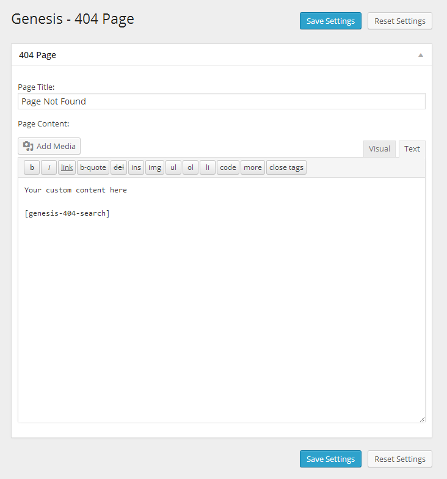

# Genesis 404 Page

Customize the content of the 404 Page within the Genesis Framework.

## Description

Customizing the contents of the _Page Not Found_ page in any WordPress theme can be tricky, and usually involes editing the 404.php template file. The Genesis Framework already abstracts the default content of the page into a function, and this plugin can unhook that and replace it with your own custom title and content.

## Screenshots

  
_Admin screen showing the fields for custom 404 Not Found page title and content._

## Requirements
 * WordPress 3.0+
 * Genesis Framework 1.8+ (supports HTML5 for Genesis Framework 2.0+)

## Installation

### WP .org repo

1. On the Add Plugin screen, search for _Genesis 404 Page_ and follow the usual steps.

### Upload

1. Download the latest tagged archive (choose the "zip" option).
2. Go to the __Plugins -> Add New__ screen and click the __Upload__ tab.
3. Upload the zipped archive directly.
4. Go to the Plugins screen and click __Activate__.

### Manual

1. Download the latest tagged archive (choose the "zip" option).
2. Unzip the archive.
3. Copy the folder to your `/wp-content/plugins/` directory.
4. Go to the Plugins screen and click __Activate__.

Check out the Codex for more information about [installing plugins manually](http://codex.wordpress.org/Managing_Plugins#Manual_Plugin_Installation).

### Git

Using git, browse to your `/wp-content/plugins/` directory and clone this repository:

`git clone git@github.com:billerickson/Genesis-404-Page.git`

Then go to your Plugins screen and click __Activate__.

## Updates

This plugin supports the [GitHub Updater](https://github.com/afragen/github-updater) plugin, so if you install that, this plugin becomes automatically updateable direct from GitHub.

See [CHANGES.md](changes.md) for the plugin changelog.

## Usage

Once installed, you can customize your 404 page's title and content in Genesis > 404 Page. 

Use the [genesis-404-search] shortcode to add a search form to the page.

If you'd like to dynamically list content (ex: most recent posts), I recommend you install the [Display Posts Shortcode](http://www.wordpress.org/extend/plugins/display-posts-shortcode/) and use it in the 404 page's content.

## Credits

Built by [Bill Erickson](http://twitter.com/BillErickson) and [Gary Jones](https://twitter.com/GaryJ)  
Copyright 2012 [Bill Erickson](http://www.billerickson.net)
